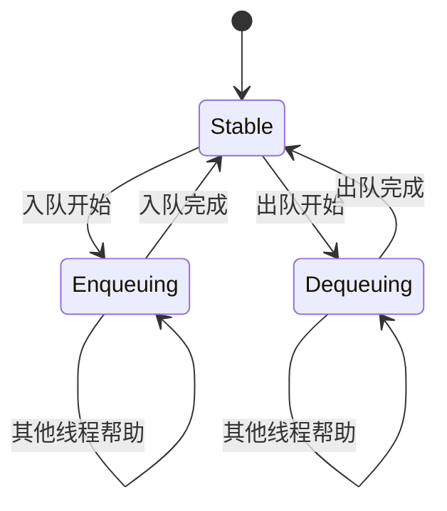

# ATOMIC

## 概念

原子操作指的是在多线程（或多核处理器）环境下，不可被中断地完成的操作。当一个线程执行一个原子操作时，其他线程无法观察到该操作执行到一半的状态，也不会在操作中途插入并修改操作所涉及的数据。原子操作是构建无锁数据结构、同步原语（如自旋锁）以及高效并发计数器等的基础。

传统锁 vs 原子操作：

锁 (Mutex)： 通过互斥访问来解决数据竞争。线程在访问共享数据前加锁，操作完成后解锁。这保证了操作的临界区的原子性，但引入了线程阻塞、上下文切换等开销。

原子操作： 直接在硬件指令级别保证特定操作的原子性（如读-修改-写）。通常比锁更轻量级（开销更小），避免了线程阻塞。但原子操作通常只适用于非常简单的操作（如加/减、位操作、交换、比较并交换），对于复杂的操作序列，仍然需要锁。

C11 标准正式将原子操作纳入语言核心，通过头文件 `<stdatomic.h>` 提供了一系列宏、类型和函数。

## API

C11标准通过`<stdatomic.h>`提供一套完整的原子操作API

### 原子类型声明

1. 内置原子类型：`atomic_x`，表示对应类型的原子类型，比如`atomic_int`表示原子整型
2. 泛型原子类型：`_Atomic(T)`，表示任意类型`T`的原子变量
3. 原子标志类型：`atomic_flag`

### 原子操作核心API

- `explicit`版本可以指定**内存序**

1. 加载操作（LOAD） —— 原子读

```C
C atomic_load(const volatile A* obj);
C atomic_load_explicit(const volatile A* obj, memory_order order);
// example
int value = atomic_load(&counter);  // 默认顺序一致性
int relaxed = atomic_load_explicit(&counter, memory_order_relaxed);
```

2. 存储操作（STORE） —— 原子写

```C
void atomic_store(volatile A* obj, C desired);
void atomic_store_explicit(volatile A* obj, C desired, memory_order order);
// example
atomic_store(&flag, 1);
atomic_store_explicit(&flag, 0, memory_order_release);
```

3. 交换操作（EXCHANGE）

原子替换为新值，并返回旧值

```C
C atomic_exchange(volatile A* obj, C desired);
C atomic_exchange_explicit(volatile A* obj, C desired, memory_order order);
// example
int old = atomic_exchange(&lock, 1);  // 获取锁
```

4. **原子比较交换（CAS）**

核心并发原语，用于实现无锁数据结构

```C
// 强版本
bool atomic_compare_exchange_strong(volatile A* obj, C* expected, C desired);
bool atomic_compare_exchange_strong_explicit(...);

// 弱版本
bool atomic_compare_exchange_weak(volatile A* obj, C* expected, C desired);
bool atomic_compare_exchange_weak_explicit(volatile A* obj, C* expected, C desired, memory_order succ, memory_order fail);

// succ参数是比较成功时，写入操作的内存序，fail则是比较失败时加载的内存序；不带explicit的版本，两个参数默认为memory_order_seq_cst
```

CAS的操作是：如果两者相等，那么替换为新值；否则替换为旧值

其操作逻辑可以表述为

```C
// 注意这里仅为了方便理解，并不是原子操作
if (*obj == *expected) {
    *obj = desired;
    return true;
} else {
    *expected = *obj;
    return false;
}
```

|特性|strong|weak|
|--|--|--|
|虚假失败|不会发生|可能发生|
|性能|较低|较高|
|典型用法|独立操作|循环重试|
|硬件支持|所有平台|LL/SC 架构 (ARM, RISC-V)|

5. 算数运算

原子加减，返回旧值

```C
// 加法
C atomic_fetch_add(volatile A* obj, M operand);
C atomic_fetch_add_explicit(...);

// 减法
C atomic_fetch_sub(volatile A* obj, M operand);
C atomic_fetch_sub_explicit(...);
```

6. 位运算

原子位运算，返回旧值

```C
// 位与
C atomic_fetch_and(volatile A* obj, M operand);

// 位或
C atomic_fetch_or(volatile A* obj, M operand);

// 位异或
C atomic_fetch_xor(volatile A* obj, M operand);
```

## 内存序

在并发编程中，内存顺序（Memory Order）是控制多线程间内存操作可见性的关键机制。它定义了原子操作与非原子操作之间的顺序关系，决定了线程间如何观察内存修改。

在单线程中，代码的执行顺序（程序顺序）和实际执行顺序（由于编译器和处理器优化）可能不同，但保证最终结果与顺序执行一致。然而，在多线程环境下，由于每个线程的执行顺序可能被打乱，并且每个线程有自己的缓存，因此不同线程观察到的内存操作顺序可能不一致。

内存顺序模型就是用来规定一个线程内的内存操作如何影响其他线程的可见性。

C11以枚举的形式提供如下内存序

```C
typedef enum memory_order {
    memory_order_relaxed,  // 最弱约束
    memory_order_consume,  // 数据依赖排序
    memory_order_acquire,  // 获取语义
    memory_order_release,  // 释放语义
    memory_order_acq_rel,  // 获取+释放
    memory_order_seq_cst   // 顺序一致性 (默认)
} memory_order;
```

### memory_order_relaxed

最宽松的内存序

- 只保证原子操作的原子性和修改顺序的一致性（即同一个原子变量的修改在所有线程看来顺序相同）。
- 不提供任何跨线程的同步：即线程A对非原子变量的修改，在原子操作之后发生，但线程B看到原子操作完成并不保证能看到非原子变量的修改。
- 适用场景：简单的计数器，对执行顺序没有要求。

### memory_order_consume

- 针对“数据依赖”的操作：如果后续操作依赖于当前原子操作读取的值，则这些操作不会被重排序到当前原子操作之前。
- 比acquire更弱，因为它只限制与当前原子操作有数据依赖的操作。
- 注意：由于实现复杂且效果在多数平台与acquire相同，实际使用较少。

### memory_order_acquire

- 通常用于读操作（load）。保证后续的内存操作（包括非原子操作）不会被重排序到该原子操作之前。
- 同时，如果另一个线程使用release对同一个原子变量进行写操作，那么当前线程可以看到release操作之前的所有内存操作（即同步释放线程的修改）。

### memory_order_release

- 通常用于写操作（store）。保证前面的内存操作（包括非原子操作）不会被重排序到该原子操作之后。
- 当另一个线程使用acquire操作读取到该原子操作写入的值时，该线程可以看到release操作之前的所有内存操作。

### memory_order_acq_rel

- 结合了acquire和release，用于读-修改-写操作（如compare_exchange，fetch_add等）。
- 对于当前线程，该操作之前的内存操作不会被重排到该操作之后，之后的操作不会被重排到该操作之前。
- 同时，该操作具有同步效果：它会与使用acquire操作读取该原子操作的线程，以及使用release操作写入该原子操作的线程进行同步。

### memory_order_seq_cst

- 默认的内存顺序，最严格的顺序。
- 除了包含acq_rel的语义外，还保证所有线程看到的所有seq_cst操作的顺序都是一致的（全局顺序）。
- 该模型会阻止所有可能的重排序，因此性能开销最大，但最符合直觉。

### 同步关系

释放（release）和获取（acquire）操作可以建立同步关系：

线程A：写原子变量（release） -> 线程B：读同一个原子变量（acquire）

这样，线程A在release操作之前的所有写操作（包括非原子变量）在线程B执行acquire之后都是可见的。

## Michael-Scott无锁队列算法

Michael-Scott算法是1996年由Maged Michael和Michael Scott提出的经典无锁队列算法，它支持多生产者多消费者(MPMC)场景。

代码：[lock_free_queue](https://github.com/caishanyu/c-corekit/blob/main/atomic/atomic_queue.c)

### 状态机

队列有三种基本状态：
1. 稳定状态：`tail->next == NULL`，`tail`指向最后一个节点，`head`指向第一个节点
2. 入队中间状态：`tail-->next != NULL`，新节点已经添加但`tail`还未更新
3. 出队中间状态：`head != tail`，头节点已经出队，但新的`head`没有更新



### 入/出队实现

在注释中给出分析

```C
// 入队
STATUS enqueue(LockFreeQueue *q, void *data)
{
    Node *new_node = NULL;
    Node *tail = NULL;
    Node *next = NULL;

    if(!q)
    {
        return ERROR;
    }

    new_node = create_node(data);
    if(!new_node)
    {
        return ERROR;
    }

    while(1)
    {
        // 1. 读取当前尾指针和它的下一个节点
        tail = atomic_load_explicit(&q->tail, memory_order_acquire);
        next = atomic_load_explicit(&tail->next, memory_order_acquire);
        
        // 2. 检查尾指针是否被其他线程修改
        // 别的线程可能此时已完成入队
        // head->A->B->C(tail, q->tail)->NULL(next)     读tail和next时的队列
        // head->A->B->C(tail)->D(q->tail)->NULL        执行下面判断前一时刻
        // 若是上述情况，重新拿tail和next，更新到最新状态
        if (tail != atomic_load_explicit(&q->tail, memory_order_relaxed)) 
        {
            continue;
        }
        
        // 3. 如果尾指针不是真正的尾部，帮助其他线程推进尾指针
        // 别的线程可能此时添加了节点（修改了队尾节点next），但是没更新tail指针，即另一个线程跳过了步骤3，执行了步骤4的if，还未执行5
        // head->A->B->C(tail, q->tail)->D(next)-> NULL 步骤2后状态
        // 若是上述情况，CAS将q->tail更新到D，然后重新拿tail和next
        if (next != NULL) 
        {
            atomic_compare_exchange_weak_explicit(&q->tail, &tail, next, memory_order_release, memory_order_relaxed);
            continue;
        }
        
        // 4. 尝试将新节点添加到尾部
        // head->A->B->C->D(q->tail, tail)->NULL(next)，next == tail->next，判断成立
        // 将new_node插到队尾，变成 head->A->B->C->D(q->tail, tail)->new_node(tail->next)->NULL
        if (atomic_compare_exchange_weak_explicit(&tail->next, &next, new_node, memory_order_release, memory_order_relaxed))
        {
            // 5. 尝试更新尾指针到新节点
            // head->A->B->C->D(q->tail, tail)->new_node(tail->next)
            // q->tail == tail成立，将q->tail推进到new_node
            atomic_compare_exchange_weak_explicit(&q->tail, &tail, new_node, memory_order_release, memory_order_relaxed);
            return OK;
        }
    }
}

// 出队操作
void* dequeue(LockFreeQueue* q) {
    Node* head = NULL;
    Node* tail = NULL;
    Node* next = NULL;
    void* data = NULL;

    if(!q)
    {
        return NULL;
    }
    
    while (1) 
    {
        // 1. 读取头指针、尾指针和头节点的下一个节点
        // head(q->head)->A->B->C(q->tail, tail)->NULL(next)
        head = atomic_load_explicit(&q->head, memory_order_acquire);
        tail = atomic_load_explicit(&q->tail, memory_order_acquire);
        next = atomic_load_explicit(&head->next, memory_order_acquire);
        
        // 2. 检查头指针是否被其他线程修改
        // head(q->head)->A->B->C(q->tail, tail)->NULL(next)
        if (head != atomic_load_explicit(&q->head, memory_order_relaxed)) {
            continue;
        }
        
        // 3. 队列为空的情况
        // 对于本实现，包含一个哨兵节点，空队列即：head(q->head, q->tail, tail)->NULL(next)
        if (head == tail) 
        {
            if (next == NULL) {
                return NULL; // 队列为空
            }
            // 帮助推进尾指针
            // 走到这里说明有别的线程入队，但还没有修改tail，队列此时为
            // head(q->head, q->tail, tail)->A(next)->NULL
            // 那么尝试将q->tail推进到next上
            atomic_compare_exchange_weak_explicit(&q->tail, &tail, next, memory_order_release, memory_order_relaxed);
        } 
        else 
        {
            // 4. 读取数据
            // head->A(next)->B(tail)->NULL
            data = next->data;
            
            // 5. 尝试移动头指针到下一个节点
            // head(q->head)->A(next)->B(tail)->NULL
            // 这里相当于将A当作新的哨兵节点，data域完全不重要
            // A(q->head)->B(q->tail)->NULL
            if (atomic_compare_exchange_weak_explicit(&q->head, &head, next, memory_order_release, memory_order_relaxed)) 
            {
                // 安全释放旧头节点（实际应用中需要更安全的内存回收机制）
                // 仅有一个线程可以进入if body，执行free
                free(head);
                return data;
            }
        }
    }
}
```

